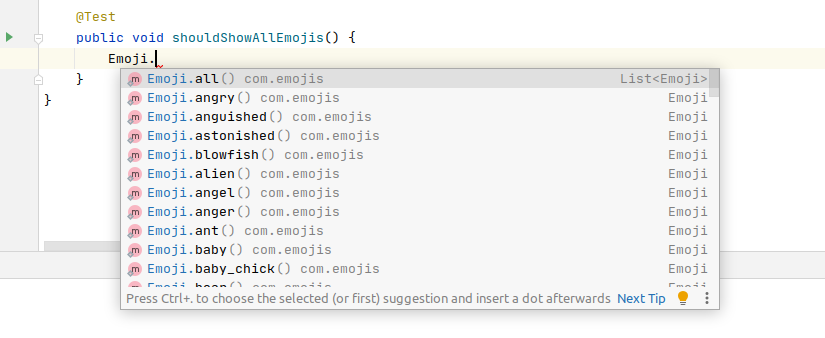

[](https://mvnrepository.com/artifact/io.github.yogonza524/roman-code)

# Emojis
Simple Java library for use emojis :smile:

## Add to your project
To add as dependency using Maven, you should have at ```pom.xml```:
```xml
<dependency>
  <groupId>io.github.yogonza524</groupId>
  <artifactId>emoji</artifactId>
  <version>0.0.2</version>
</dependency>
```

To add as dependency using Gradle, you should have at ```build.gradle```:
```groovy
repositories {
    mavenCentral()
}

dependencies {
    implementation "io.github.yogonza524:emoji:0.0.2"
}
```
## Examples

1. Use an emoji
```java
Emoji bowtie = Emoji.bowtie();

System.out.println("Code: " + bowtie.getCode()); // :bowtie:
System.out.println("Icon: " + bowtie.getImageUrl()); // https://github.githubassets.com/images/icons/emoji/bowtie.png
```

2. Find an emoji
```java
List<Emoji> man = Emoji.find("man"); // Return a list of Emijis when name contains "man"
```

3. List all Emojis
```java
Emoji.all().stream().forEach(System.out::println); // Show all Emojis available
```

4. Get the URL as markdown
```java
Emoji bowtie = Emoji.bowtie();
System.out.println(bowtie.markdown()); //
```